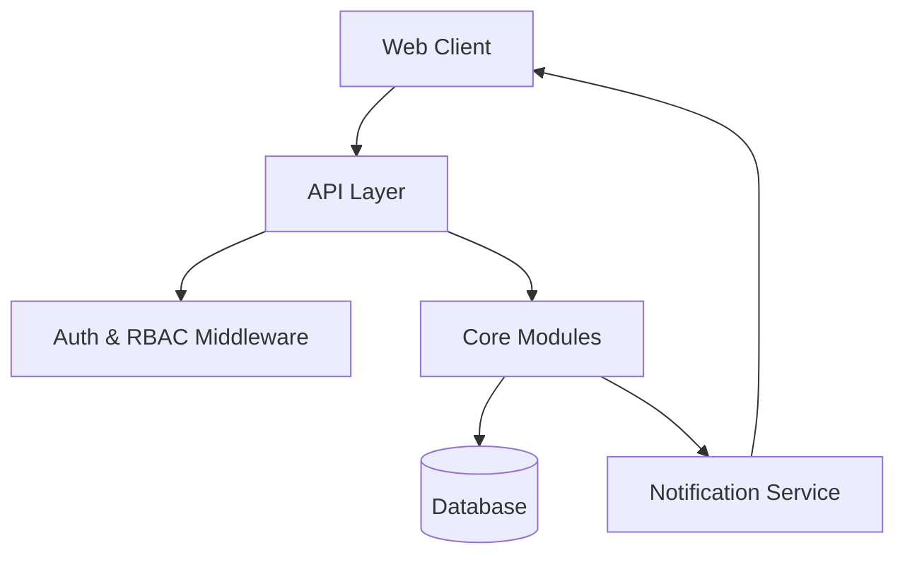
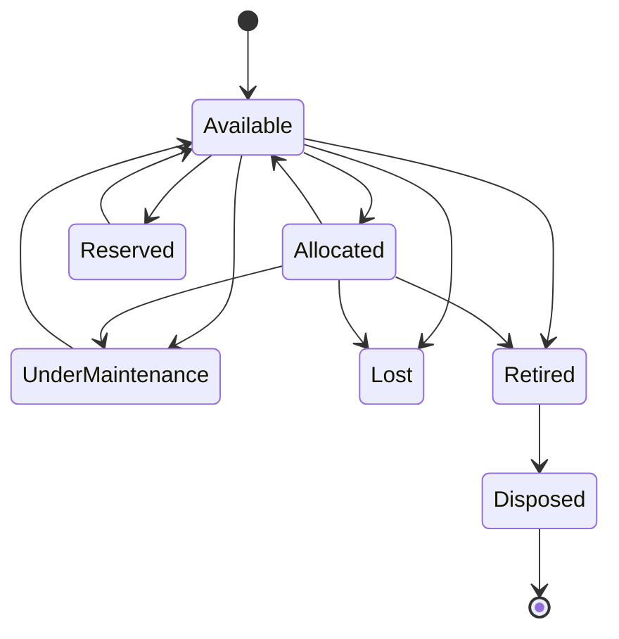
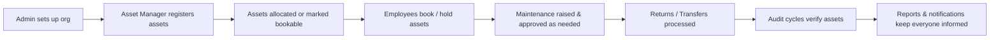

#  AssetFlow

**Enterprise Asset & Resource Management System**

AssetFlow is a modern ERP platform that helps organizations track, allocate, and maintain physical assets and shared resources — replacing spreadsheets and paper logs with structured lifecycles, conflict-free booking, and approval-driven workflows.

> Register it. Allocate it. Book it. Maintain it. Audit it. Never lose track of it again.

---

##  Features

-  Role-based access control (Admin, Asset Manager, Department Head, Employee)
-  Organization setup — departments, asset categories, employee directory
-  Full asset registration and lifecycle tracking
-  Allocation & transfer workflows with double-allocation prevention
-  Shared resource booking with overlap validation
-  Maintenance requests with mandatory approval workflow
-  Structured audit cycles with auto-generated discrepancy reports
-  Reports & analytics for utilization, maintenance, and bookings
-  Real-time notifications for overdue items and key events
-  Full activity log for accountability

---

##  Tech Stack

| Layer | Technology |
|---|---|
| Frontend | _TBD_ |
| Backend | _TBD_ |
| Database | _TBD_ |
| Authentication | _TBD_ |
| Hosting | _TBD_ |

---

##  System Architecture



---

##  Folder Structure

```
assetflow/
├── client/                 # Frontend application
│   ├── src/
│   │   ├── components/
│   │   ├── pages/
│   │   ├── hooks/
│   │   └── services/
│   └── public/
├── server/                  # Backend application
│   ├── src/
│   │   ├── controllers/
│   │   ├── models/
│   │   ├── routes/
│   │   ├── middleware/
│   │   └── services/
│   └── config/
├── docs/                     # PRD, diagrams, docs
└── README.md
```

---

##  Core Modules

- **Authentication** — signup/login, session management
- **Dashboard** — KPI cards, quick actions, overdue highlights
- **Organization Setup** — departments, categories, employee directory
- **Asset Registration** — asset creation, search, per-asset history
- **Asset Allocation & Transfer** — holder assignment, transfer workflow, returns
- **Resource Booking** — calendar-based booking with overlap checks
- **Maintenance** — request → approval → repair → resolution
- **Audit** — cycle creation, verification, discrepancy reports
- **Reports & Analytics** — utilization, maintenance, booking insights
- **Notifications & Activity Logs** — real-time alerts and full audit trail

---

##  Role Based Access

| Role | Responsibilities |
|---|---|
| **Admin** | Manages departments, categories, audit cycles, and role assignment; views org-wide analytics |
| **Asset Manager** | Registers/allocates assets; approves transfers, maintenance, and audit resolution |
| **Department Head** | Views departmental assets; approves departmental requests; books resources |
| **Employee** | Views own assets; books resources; raises maintenance and transfer requests |

>  Accounts are never self-elevated. Signup always creates an Employee account — only an Admin can promote users to Department Head or Asset Manager.

---

##  Asset Lifecycle



---

##  Screens

1. Login / Signup
2. Dashboard / Home
3. Organization Setup (Departments · Categories · Employee Directory)
4. Asset Registration & Directory
5. Asset Allocation & Transfer
6. Resource Booking
7. Maintenance Management
8. Asset Audit
9. Reports & Analytics
10. Activity Logs & Notifications

---

##  Project Workflow



---

##  Installation

```bash
git clone https://github.com/your-org/assetflow.git
cd assetflow
```

---

##  Environment Variables

Create a `.env` file in the `server/` directory:

```env
DATABASE_URL=
JWT_SECRET=
PORT=
NODE_ENV=
```

---

## ▶ Running Locally

```bash
# Install dependencies
cd client && npm install
cd ../server && npm install

# Start backend
npm run dev

# Start frontend (in a separate terminal)
cd ../client && npm run dev
```

---

##  Future Improvements

-  QR code scanning for asset lookup
-  RFID / IoT-based asset tracking
-  Native mobile app
-  Predictive maintenance
-  AI-driven analytics
-  Multi-organization support
-  Single Sign-On (SSO)

---

##  Contributing

Contributions are welcome! Please open an issue to discuss significant changes before submitting a pull request.

1. Fork the repository
2. Create a feature branch (`git checkout -b feature/your-feature`)
3. Commit your changes
4. Open a pull request

---

##  License


---

##  Acknowledgements

Built as part of a hackathon project to explore ERP-style asset and resource management workflows.